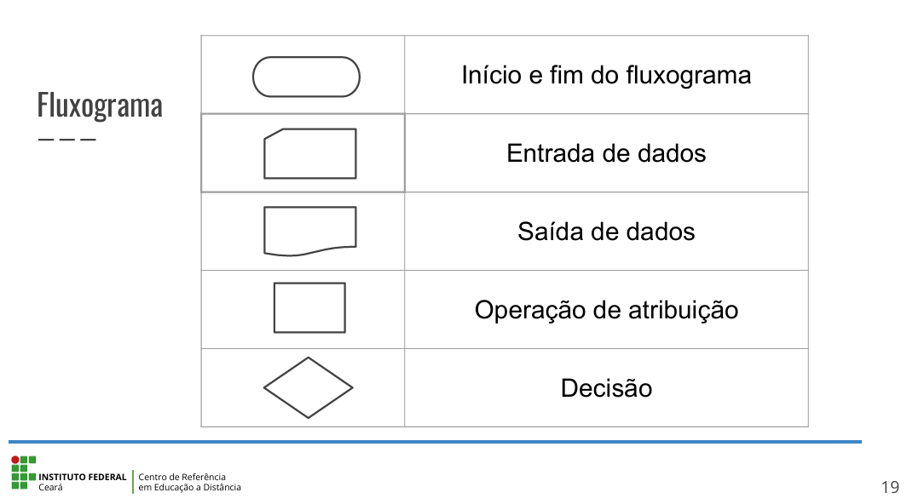
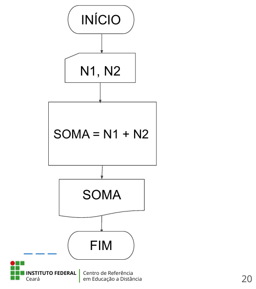
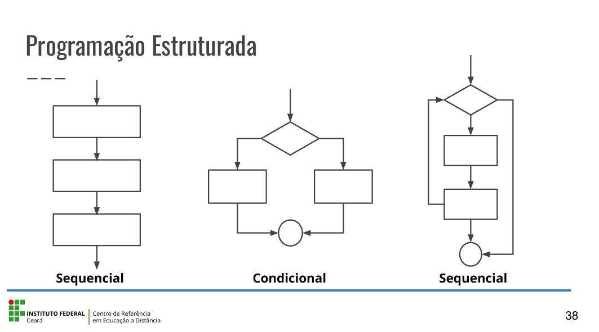

# Aula - Introdução à Programação

## Computador

- Software
- Hardware

## Etapas do desenvolvimento de software

### Análise

- Entender o problema
- Identificar as entradas
- Definir a estratégia de processamento
- Identificar as saídas

### Algoritmo

- Definir a solução para o problema em forma de passos, com detalhes sobre seu processamento, entradas e saídas

### Codificação

- Escrever o algoritmo na linguagem de programação escolhida

## O que é um Algoritmo?

> _“Algoritmo é uma sequência de passos que visa atingir um objetivo bem definido” (FORBELLONE, 1999)."._

## Algoritmo para escovar os dentes

1. Molhar a escova
2. Aplicar pasta de dente
3. Escovar cada dente por um determinado tempo
4. Enxaguar a boca
5. Enxaguar a escova
6. Guardar a escova

## Algoritmo para trocar uma lâmpada

1. pegar a nova lâmpada
2. pegar a escada
3. posicionar a escada abaixo da lâmpada que deve ser
   trocada
4. subir a escada de posse da nova lâmpada
5. retirar a lâmpada queimada
6. colocar a nova lâmpada
7. descer da escada
8. acionar o interruptor para testar a lâmpada
9. guardar a escada
10. descartar a lâmpada queimada

## Formas de representação de um algoritmo

- Descrição narrativa
- Fluxograma
- Pseudocódigo

## Exemplo de um Algoritmo

- Escreva um algoritmo que solicite dois números inteiros como entrada e exiba sua soma na tela

### Descrição narrativa

1. Receber as duas notas
2. Calcular a soma
3. Exibir a soma

### Fluxograma





### Pseudocódigo

```js
Algoritmo <nome_do_algoritmo>
 <declaracao_de_variaveis>
Inicio
 <corpo_do_algoritmo>
Fim
```

```jsx
Algoritmo soma
 var numero1, numero2, soma: inteiro
Inicio
 escreva("Digite os números: ")

 leia(numero1)
 leia(numero2)

 soma = numero1 + numero2
 escreva(soma)
Fim
```

## Programa

- Programa é um conjunto de instruções usadas por um computador para realizar uma determinada tarefa

### Exemplos de programas

- WhatsApp
- Telegram
- Instagram
- Facebook
- Twitter
- Gmail
- YouTube
- Netflix
- macOS
- Windows
- Linux
- Eclipse
- Visual Studio Code

## Linguagens de Programação

- Computador é formado de circuitos elétricos
- Sistema binário
  - 0 - desligado
  - 1 - ligado
- Existem várias linguagens de programação

Segundo a definição da IEEE, _"uma linguagem de programação é um conjunto de símbolos e regras sintáticas e semânticas usados para definir um programa de computador"_.

### Tipos de Linguagens de Programação

- Alto nível
- Baixo nível

### Exemplos de Linguagens de Programação

| **C**                                              | **Python**                                                                              | **Java**                                            | **JavaScript**                            | **SQL**                               |
| -------------------------------------------------- | --------------------------------------------------------------------------------------- | --------------------------------------------------- | ----------------------------------------- | ------------------------------------- |
| Sistemas operacionais, jogos e aplicativos desktop | Ciência de dados, inteligência artificial, aprendizado de máquina e desenvolvimento web | Aplicativos móveis, jogos e aplicações empresariais | Criar páginas web interativas e dinâmicas | Gerenciar e consultar bancos de dados |

## Paradigmas de Programação

- Conjunto de conceitos e técnicas que definem como um programa deve ser organizado e escrito
- Esses paradigmas fornecem uma maneira de pensar e abordar problemas de programação, e incluem diferentes abordagens para modelar a solução de um problema

### Exemplos de Paradigmas de Programação

- Paradigma Imperativo
- Paradigma Orientado a Objetos
- Paradigma Funcional
- Paradigma Lógico
- Paradigma de Programação Concorrente

## Programação Estruturada



- A programação estruturada também enfatiza a modularidade, dividindo o código em pequenos blocos de construção chamados de procedimentos ou funções
- Esses blocos de construção podem ser reutilizados em diferentes partes do programa, o que ajuda a tornar o código mais eficiente e fácil de manter
- Linguagens de programação que utilizam a programação estruturada incluem C, Pascal e Ada
- A programação estruturada é amplamente utilizada em programação de sistemas operacionais

### Exemplo de Programa Estruturado

- Exemplo de programa estruturado em JavaScript que solicita ao usuário um número e verifica se ele é par ou ímpar

```js
const numero = parseInt(prompt("Digite um número: "));

if (numero % 2 === 0) {
  alert("O número digitado é par");
} else {
  alert("O número digitado é ímpar");
}
```

## Compiladores x Interpretadores

- Se o computador não é capaz de entender as linguagens de programação como os programas funcionam?

## Compilador

**Etapas do processo de compilação:**

- Análise léxica
- Análise sintática
- Análise semântica
- Otimização de código
- Geração de código objeto

O resultado final é um arquivo executável que pode ser executado diretamente em um computador ou máquina virtual

### Exemplos de Linguagens Compiladas

**Alguns exemplos de linguagens compiladas incluem:**

- C, C++ e Objective-C
- Fortran
- Swift
- Rust
- Pascal
- Ada

## Interpretadores

- O interpretador executa o programa linha por linha, verificando cada comando e instrução para ver se ele pode ser executado
- Se o comando é válido, o interpretador executa a instrução associada
- Se houver um erro, o interpretador geralmente interrompe a execução do programa e apresenta uma mensagem de erro ao usuário

### Exemplos de Linguagens Interpretadas

**Alguns exemplos de linguagens interpretadas incluem:**

- Python
- Ruby
- JavaScript
- Perl

## Tipos de Dados Básicos

- Tipos de dados referem-se aos diferentes tipos de valores que podem ser armazenados e manipulados em um programa de computador
- Cada tipo de dado tem um conjunto específico de operações que podem ser realizadas sobre ele
- Por exemplo, é possível adicionar, subtrair, multiplicar e dividir números, enquanto as strings podem ser concatenadas, comparadas e divididas em substrings

### Exemplos de Tipos de Dados Básicos

- **Inteiros:** números inteiros, como `-10`, `0`, `42`
- **Números de ponto flutuante:** números com casas decimais, como `3.14`, `0.5`
- **Booleanos:** valores lógicos verdadeiros ou falsos, representados por `true` ou `false`
- **Caracteres:** caracteres únicos, como `'a'`, `'Z'`, `'?'`
- **Strings:** sequências de caracteres, como `"Olá, mundo!"` ou `"1234”`

## Tipos de Dados Mais Complexos

- **Arrays:** coleções de valores do mesmo tipo, como `[1, 2, 3, 4]` ou `["maçã", "banana", "laranja"]`
- **Ponteiros:** valores que apontam para posições de memória, usados para trabalhar com estruturas de dados mais complexas
- **Estruturas:** tipos de dados personalizados que contêm vários campos, como um registro em um banco de dados
